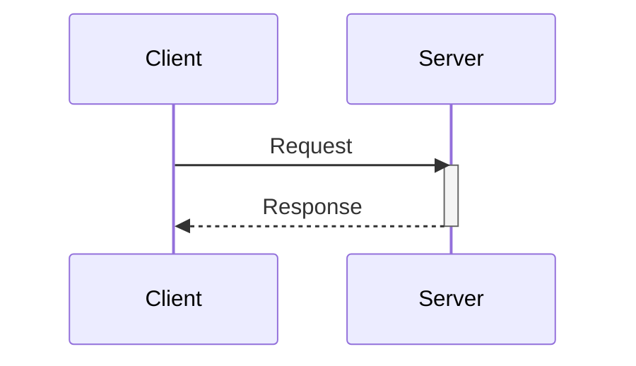
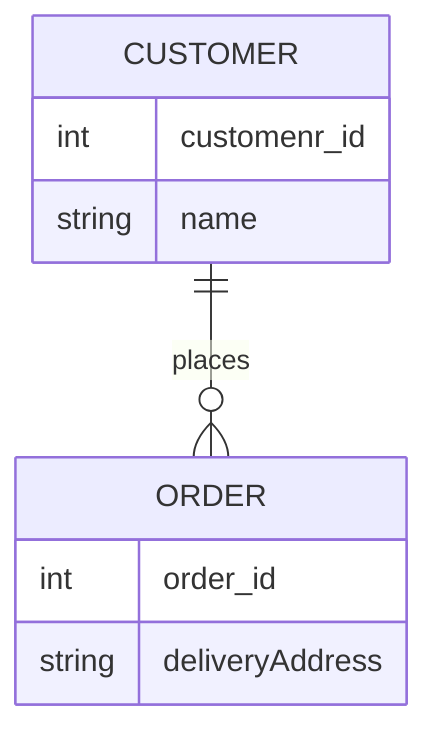

# Homework 1

Please answer the following questions in this document, under each question, and submit your work on Gradescope by, Tue, Feb 6, at 11:00 PM ET.

## Personal Information

* Your full name as it appears on Gradescope:
* The link to this reposiotry:

## Scenario

There is a contest where you can vote for your favorite TV series. The contest features ten popular TV series, including Friends, Game of Thrones, The Big Bang Theory, Breaking Bad, and others. The contest will last for a few hours.

We need to develop an application to support this voting contest. The voting application should cater to a regional audience across the entire U.S. and be accessible on both mobile and desktop platforms. We want to prevent users from voting multiple times, but we also want to avoid the complexities and frictions of traditional user registration and authentication.

Administrators of the voting application should have access to the current vote count. Due to the short voting period, we anticipate a high frequency of votes, potentially reaching tens of thousands per second.

## Question 1

Identify at least two user roles for the app based on the provided scenario. Write a functional requirement from the perspective of each in the format of a user story. The requirements must be based on the provided scenario.

## Question 2

Write three non-functional requirements based on the scenario provided. You should write two system quality attributes (choose from: availability, performance, scalability, and reliability) and one system constraint (choose from: technical, business, legal). Label each requirement accordingly, e.g., #scalability or #legal.

## Question 3

Write two clarifying questions you would ask an interviewer if they had asked you to design the software described above. One question should clarify a functional requirement, and the other should clarify a non-functional requirement. Label them to indicate which is which. For each question, further explain why you are asking it, i.e., how it affects your design.

## Question 4

Draw a sequence diagram illustrating the process of a user voting for a TV series, the system recording the vote, and the real-time update being sent to the admin dashboard. If you need more information about the system requirements, make assumptions.

> You can use [Mermaid.js syntax to draw sequence diagrams](https://mermaid.js.org/syntax/sequenceDiagram.html). GitHub renders the diagram!

Here is an example: 

## Question 5

If the TV series voting application expanded its features allowing users to register, create profiles, and review TV series, seasons, or episodes, how would the relational data model look? Draw an Entity Relationship Diagram (ERD) considering entities like Users, TV Series, Seasons, Episodes, and Reviews. Ensure your model is in third normal form (3NF).

> You can use [Mermaid.js syntax to ERDs](https://mermaid.js.org/syntax/entityRelationshipDiagram.html). GitHub renders the diagram!

Here is an example: 

